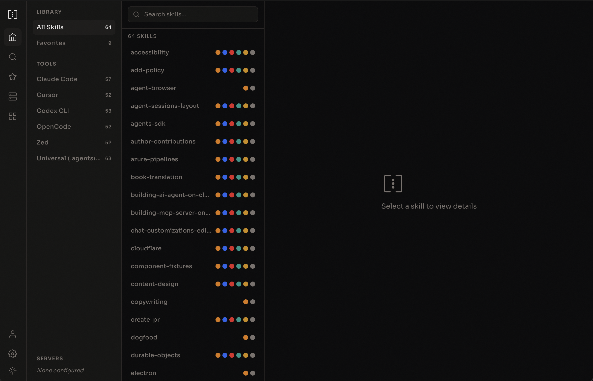

> **macOS users on 0.7.0 or earlier: please update manually.** The in-app updater in those versions has two problems. It can quit the app and never relaunch it when a macOS system update is waiting to be installed, and it serves Apple Silicon Macs the Intel build. Both are fixed from 0.7.1 onward, but the update to 0.7.1 itself has to be done by hand: download the DMG from the [releases page](https://github.com/skillsgate/skillsgate/releases/latest), pick the `arm64` file on Apple Silicon or the plain `.dmg` on Intel, and drag SkillsGate to Applications. Your settings, favorites, and installed skills are kept. Later updates will install normally.

<p align="center">
  
</p>

<h1 align="center">SkillsGate</h1>

<p align="center">Visual skill manager for AI agents.</p>

<p align="center">
  <a href="https://skillsgate.ai">Website</a>
</p>

<p align="center">
  
  
  
  
</p>

<p align="center">
  
</p>

---

## What is SkillsGate?

SkillsGate lets you browse, install, and manage AI agent skills from a single interface. It works with 20+ agents and integrates [skills.sh](https://skills.sh) for public skill discovery.

Instead of hunting through GitHub repos and copying markdown files by hand, you open SkillsGate, search for what you need, and install it to any combination of agents with one click.

Available as a **desktop app** for macOS, Windows, and Linux.

## Quick Start

[Download the latest release](https://github.com/skillsgate/skillsgate/releases/latest) for macOS (Apple Silicon or Intel), Windows, or Linux. Every release ships a DMG, an NSIS installer, an AppImage, and a Debian package.

> **Terminal UI discontinued.** The `skillsgate` and `@skillsgate/tui` npm packages are deprecated and no longer maintained. `npx skillsgate` still runs the last published version but will not receive updates. Use the desktop app instead. For command-line installs of public skills, use [`npx skills add`](https://skills.sh).

## Supported Agents

Claude Code, Cursor, Windsurf, GitHub Copilot, Cline, Continue, Codex CLI, Droid CLI, OB-1, Amp, Goose, Junie, Kilo Code, OpenCode, OpenClaw, Pear AI, Roo Code, Trae, Zed, and Universal.

## Features

- **skills.sh integration** -- browse and search the full public catalog directly from the app
- **Per-agent management** -- install a skill to specific agents or all of them at once, remove from one without affecting the others
- **Built-in editor** -- view rendered skill content or edit the raw source with a CodeMirror editor, saved to disk instantly
- **Remote servers** -- connect to other machines via SSH to browse and sync skills
- **Private skills** -- keep skills local to your machine or share them with your team
- **Favorites** -- star skills from the catalog for quick access
- **Local-first** -- settings, favorites, and remote server configs live in a local SQLite database, no account required

## Development

This is a monorepo managed with npm workspaces.

```
apps/
  web/          React Router v7 on Cloudflare Workers
  desktop/      Electron desktop app

packages/
  ui/           Shared React components
```

### Running locally

```bash
# Install dependencies
npm install

# Native desktop dependencies are rebuilt for Electron automatically.
# If install scripts were skipped, run this before starting the desktop app:
# npm run rebuild:native --workspace=@skillsgate/desktop

# Web app (default workspace dev server)
npm run dev

# Desktop app
cd apps/desktop && npm run dev

# Deploy web app to Cloudflare
npm run deploy
```

Requires Node.js 22+ and, for web deploys, a Cloudflare account.

The desktop app uses the native `better-sqlite3` module. A normal `npm install`
rebuilds it for the Electron version pinned by the desktop workspace. If you
install with `--ignore-scripts` or encounter a native module ABI mismatch, run
`npm run rebuild:native --workspace=@skillsgate/desktop` manually.

## Contributing

SkillsGate is open source. Contributions welcome.

1. Fork the repo
2. Create a feature branch
3. Make your changes
4. Open a pull request

## License

MIT

---

<p align="center">
  Built by Sultan Valiyev
</p>
